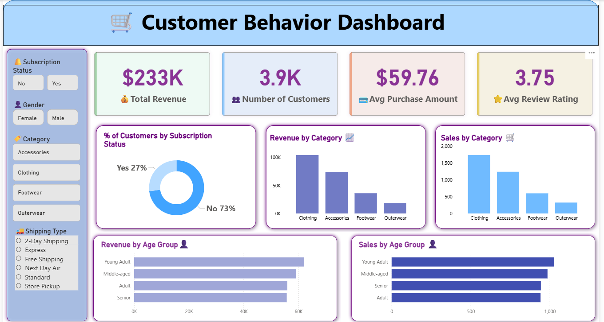

# Customer Shopping Behavior Analysis

## 📌 Project Overview

This project analyzes customer shopping behavior using transactional data from **3,900 purchases** across multiple product categories. The objective is to uncover insights into customer spending patterns, product preferences, subscription behavior, and purchase drivers to support data-driven business decisions.

The project follows an end-to-end analytics workflow:

**Python → MySQL → SQL → Power BI → Business Insights**

---

## 🎯 Business Problem

A retail company wants to better understand customer shopping behavior to improve sales, customer satisfaction, and customer loyalty. The analysis focuses on identifying trends across demographics, product categories, discounts, reviews, subscriptions, and purchasing patterns.

---

## 🛠️ Tools & Technologies

* Python (Pandas, SQLAlchemy)
* MySQL
* SQL
* Power BI
* Git & GitHub
* VS Code

---

## 📂 Dataset Information

* Total Records: **3,900**
* Features: **18**
* Includes:

  * Customer Demographics
  * Purchase Details
  * Shopping Behavior
  * Subscription Information
  * Shipping Preferences
  * Product Reviews

---

## 🐍 Python Data Preparation

### Data Cleaning

* Handled missing review ratings using median imputation by category
* Standardized column names using snake_case
* Removed redundant fields
* Performed data quality checks

### Feature Engineering

* Created Age Group categories
* Derived Purchase Frequency Days
* Prepared data for database integration

---

## 🗄️ SQL Analysis

Business questions answered:

1. Revenue by Gender
2. High-Spending Discount Users
3. Top 5 Products by Rating
4. Shipping Type Comparison
5. Subscribers vs Non-Subscribers
6. Discount-Dependent Products
7. Customer Segmentation
8. Top 3 Products per Category
9. Repeat Buyers & Subscription Analysis
10. Revenue by Age Group

---
## 📊 Dashboard Preview



## 📊 Power BI Dashboard

Interactive dashboard features:

* 💰 Total Revenue
* 👥 Number of Customers
* ⭐ Average Review Rating
* 🛒 Average Purchase Amount
* Revenue by Category
* Sales by Category
* Revenue by Age Group
* Subscription Analysis
* Interactive Filters & Slicers

---

## 🔍 Key Insights

* Young Adult customers generated the highest revenue.
* Male customers contributed more revenue than female customers.
* Subscription status influenced customer spending patterns.
* Certain products showed high dependency on discounts.
* Loyal customers represented the largest customer segment.
* Express shipping customers had higher average purchase values.

---

## 💡 Business Recommendations

* Increase subscription adoption through exclusive benefits.
* Develop customer loyalty programs.
* Optimize discount strategies to maintain profitability.
* Promote top-rated and best-selling products.
* Implement targeted marketing campaigns for high-value customer segments.

---

## 📁 Repository Structure

```text
├── customer_behaviour_analysis.py
├── Customer Shopping Behaviour Analysis.sql
├── customer_shopping_behavior.csv
├── customer_behavior_dashboard.pbix
├── Customer Shopping Behaviour Analysis.pdf
├── Business Problem Document.pdf
├── README.md
```

## 🚀 Project Outcome

This project demonstrates an end-to-end Data Analytics workflow by combining:

* Data Cleaning & Transformation (Python)
* Database Management (MySQL)
* Business Analysis (SQL)
* Interactive Visualization (Power BI)
* Business Recommendations

The result is a comprehensive analytics solution that helps stakeholders understand customer behavior and make informed business decisions.
